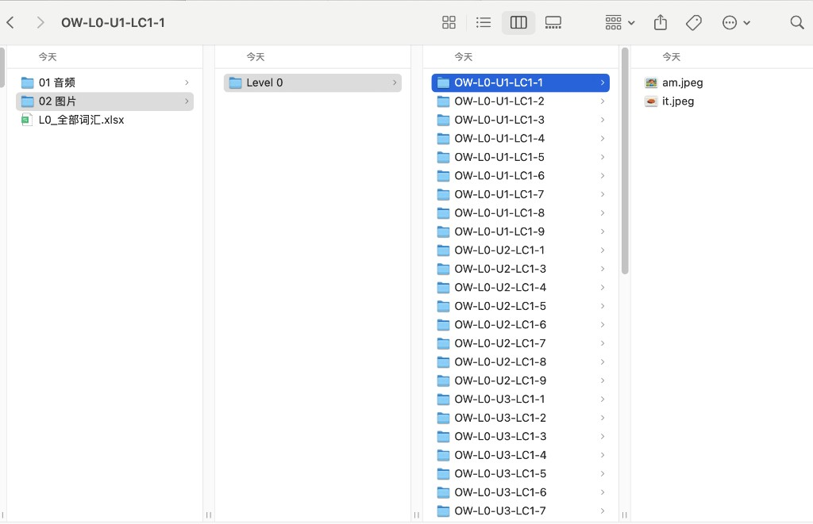
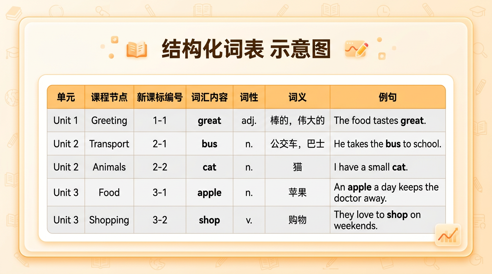
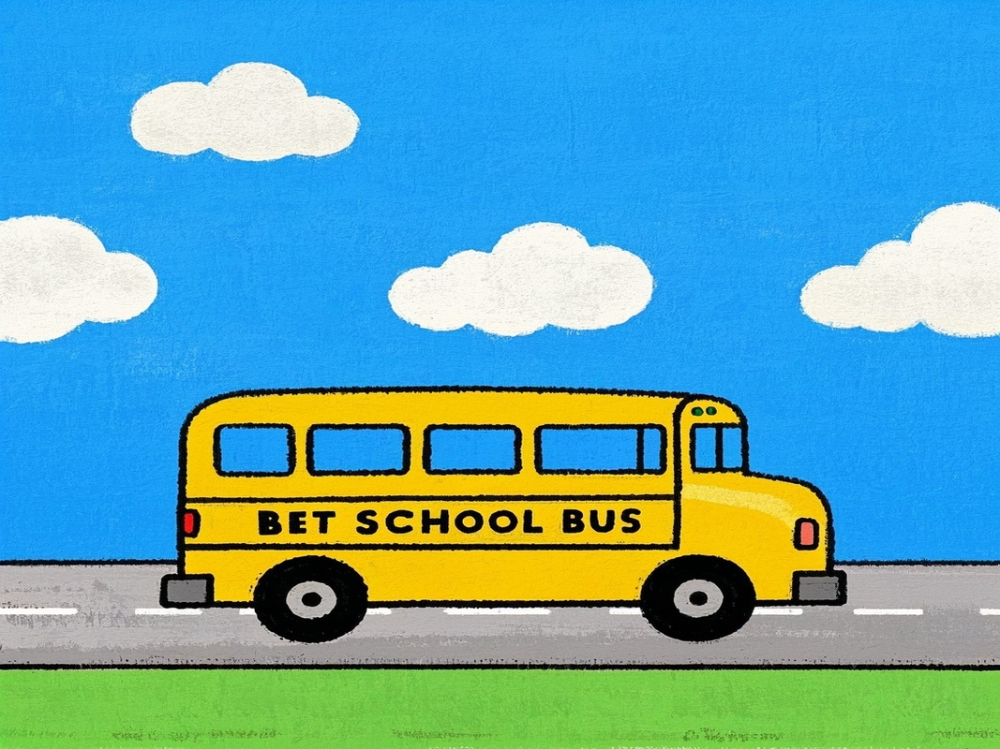

# Skill 企业实践：我们用 Skill 把单词预习的音频和图片生产时间从一周压到了半天

做教培英语内容生产，比较耗费人力的其中一部分是把教学内容做成能交付的预习资源。

比如单词预习：一个课包里有几百个单词，每个词都要配一份标准发音音频和一张孩子能看懂的配图。拿入门级别的 L0 课包粗算，10 个单元、300 个核心词，音频加图片就是至少 600 份文件。再算上词义补齐、重复词复用、目录归档和补跑修复，这件事很容易从"顺手做一下"变成连续一周的体力活。

我们后来把这整条链路封成了一个 Skill——一套可复用的自动化生产流程，输入课程脚本，自动完成抽词、补字段、生成音频、生成图片、按课程结构归档。

这个 Skill 从设计、调试到打磨出稳定可用的版本，教研老师和技术同学前后花了几天时间。但一旦跑通，后面每个新课包都是直接复用，不需要再从头来过。

Skill 跑完以后，教研老师再做一轮人工审核——确认词义准确、图片合适、没有漏词错词——审核通过的才进入正式交付。整个流程从一周压到了 30 分钟生成 + 半天人工审核。


点击发送后，Skill 自动跑完全流程。最终产出如下目录：



这是跑完一个 L0 课包后的实际产出，包含三类东西：

1. **结构化词表**：给教研、老师、运营统一使用的 Excel。
2. **发音音频**：每个词的标准发音 `.mp3` 文件。
3. **词义配图**：适合低龄学生理解的卡通 `.jpeg` 图片。

所有资源按"级别 → 课程节点 → 单词文件"的层级自动归档，教研、运营、研发可以直接取用，不需要再做二次整理。

---

## 一、从课程脚本到结构化词条

我们把整条链路拆成 5 步，但真正的核心只有一句话：**先把课程脚本变成结构化词条，再让音频和图片围着这份词表自动生产。**


输入一般是一份课程脚本 Excel，里面会有 `Level`、`Unit`、课程节点编号 `sn`，以及每节课的文本描述。问题在于，脚本里虽然写了要教什么，词汇信息却经常散落在描述、例句和教学说明里，不能直接拿来跑资源生成。

所以第一步不是"抓所有英文"，而是只提取明确作为教学目标出现的词。比如：

- `OW-L0-U1-LC1-1`（意思是 Level 0、第一单元、第一节课）里，可以提取出 `am, it`
- `OW-L0-U1-LC1-2`（同一单元的第二节课）里，可以提取出 `good, great, wonderful, hello, goodbye`

边界要卡得很死：不把字母练习、句型模板、说明文字、标题文案混进词表。否则后面生成出来的音频和图片，看起来能跑，实际上并不服务真实教学。

抽完词以后，还要补齐字段。光有一个单词还不够，至少要知道它属于哪节课、是什么词性、什么意思、配什么例句。补齐之后，每个词就从一个孤立的单词变成了一条完整的记录。

以 `great` 为例，它在词表里会带上：所属课程节点、词性（形容词）、词义（很棒的）、例句（It is great.）。后面生成音频和图片时，用的都是这些字段里的信息。



这张结构化词表，其实已经是一份独立资产。老师可以直接拿去备课，家长端可以直接做预习包，后面课程改版时也能基于它做增量更新。

词条结构化之后，音频生成就很直接了。我们基于词表里的词汇内容，调用有道发音接口批量生成 `.mp3`，按 `Level → 课程节点 → 单词文件` 归档。同一个词如果在不同节点重复出现，会先查已有资源再决定是否复用，不必每次都重新生成。

---

## 二、用 AI 批量生成单词配图

图片是整条链路里最容易"看起来很炫，实际最容易翻车"的一段，所以我们把规则写得最死。

我们用的是即梦——火山引擎旗下的一个 AI 画图工具。核心做法是：**不用孤立单词做提示词，而是直接用例句驱动画面。**

简单来说，我们给 AI 画图工具一套固定指令，告诉它该画什么、怎么画。以下是实际在用的原始提示词（没有做润色，直接贴的生产版本）：

```text
{例句}。精准帮我根据例句生成图片，风格一直为卡通，注意，一定图中不能有文字！图片主体要和例句单复数保持一致
```

这套模板里，最关键的是三个限制：

- `统一卡通风格`：让整批词图视觉一致，适合低龄学习场景。
- `图中不能有文字`：避免模型乱生成英文，误导学生认读。
- `主体和单复数一致`：句子里是 `two cats`，图里就必须是两只猫。

为什么我们坚持用例句，不直接丢一个单词给模型？因为很多词脱离语境以后会变得非常模糊。像 `great` 这种词，如果只输入单词，模型很容易画出一个情绪很散的泛化画面；但如果带上例句，它就更容易理解这是在什么课堂语境下出现的"great"。

下面是两类词的实际效果：

`am` 这类基础功能词，要求画面简洁、低龄、无干扰：


`bus` 这类名词，要求主体清楚、孩子一眼能认出来：



这一步真正拉开差距的，不是用哪个 AI 工具，而是你有没有把指令约束、语境输入和失败自动重试的规则一起设计好。少一个环节，批量质量就会明显下滑。

---

## 三、批量跑通时，真正麻烦的不是生成，而是稳定

当词量上到几百个以后，项目风险就不再是"某个词画得好不好"，而是整批任务能不能稳稳跑完。

我们实际处理的坑，主要有三类：

### 1. 重复词不重复生成

同一个词会跨多个节点反复出现。最简单也最有效的办法，就是生成前先查目录里有没有现成资源，有就复用，没有再生成。这样既省调用次数，也能减少风格漂移。

### 2. 批量生成时服务会"排队"

一次性让 AI 画几百张图，服务端会限制请求速度，就像打印机一次塞太多任务会卡住一样。所以必须让程序自动等一会儿再试，跑失败的自动补上，不然整批任务会卡在最后几张图上，人工还得回头捡漏。

### 3. 特殊词要单独照顾

数字词、功能词、抽象词，往往最考验提示词设计。像 `ten` 这类词，如果完全套通用模板，效果就不稳定。遇到这类词，我们会补一层更明确的描述，保证生成结果能过审、能教学、能复用。

说到底，教培内容生产里的"批量"从来不是一键跑完就结束。真正能落地的批量，是 `规则 + 容错 + 人工校准` 组合出来的稳定生产能力。

---

## 这套 Skill 真正改变了什么

不只是把一周缩成了半天。

更重要的是，它把原来依赖内容同学手工协调、手工命名、手工归档的流程，变成了一条可以重复、可以补跑、可以扩容的生产线。课程上新时能快速出资源，旧课重做时能快速补齐，教研、运营、家长端拿到的也都是同一套标准化结果。

单词预习只是一个起点。如果你也在做内容生产，也有类似的重复但高频的内容生产痛点，欢迎在评论区聊聊——我们可以一起看看，哪些环节适合封成 Skill。
